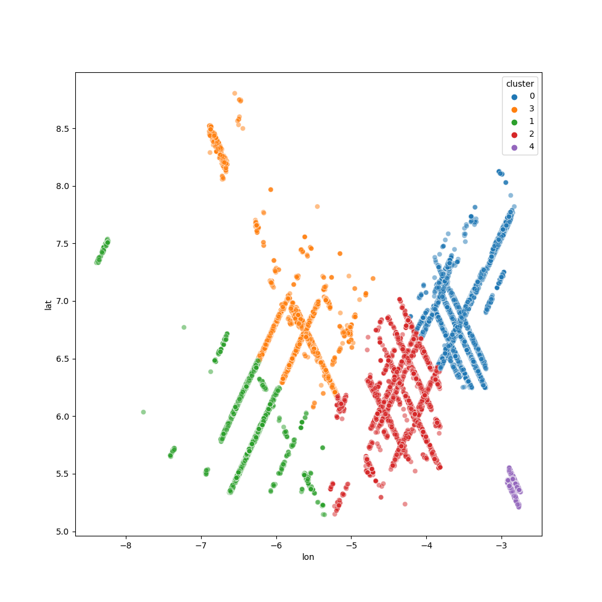

# Zindi Africa Biomass Challenge

Predicting biomass using satellite images: https://zindi.africa/competitions/africa-biomass-challenge

## Setting up/running the scripts
Clone the project from github.

```commandline
git clone https://github.com/pmwaniki/biomass-prediction
cd biomass-predictios
```
Conda environment can be set up using the *enviroment.yml* file:

```commandline
conda env create -f environment.yml

conda activate satellite
```
## Configuring data, logs and results directory
Edit the *settings.py* file to specify the directories where the data (data_dir), results (result_dir), and logs (log_dir) will be stored.


## Data pre-processing
Download the train, validation and test datasets and place them in the path defined by setting.py's data_dir. Run *python preprocessing.py* to preprocess the data. The train, validation and test datasets are combined to form a single dataset and saved into hdf5 file *train_combined.h5*. A csv containing the longitude, latitude, biomass, and mean cloud cover for each image is created (Train.csv). In addition, K-Mean clustering is used to create 5 cluster using longitude and latitude. The clusters are used in model training to define the folds in K-fold clustering. This ensures that the training and validation dataset do not overlap geographically.

The mean and variance of each band was computed and saved in *band_statistics.joblib* to be used to scale the images during model training. 
```commandline
python preprocessing.py
```



## Solution at #8 on the private leaderboard
The Solution can be found in *regression_sgd.py*. The process of hyper-parameter tuning was repeated 5 times (once for each cluster) and predictions were aggregated using unweighted mean.
There was suspicion that the model predictions were poorly calibrated given that the values of biomass in the training and submission datasets were obtained using different methods (GEDI vs GIZ).
Therefore, in an effort to improve calibration, a constant value was added to the submission predictions. A value of 65 provided the best score on the public leaderboard.


```commandline
ray start --head
python regression_sgd.py
```

### Model

A convolutional neural network (CNN) was used.
The layers of the model wer as follows:

- Group normalization
- Dropout (2D)
- Initial convolution layer
- One or more residual blocks
- Final convolution (number of output channels equal number of outputs)
- Average pooling (compute mean for each channel)


```python
class GaussianNoise(nn.Module):
    def __init__(self, stddev):
        super().__init__()
        self.stddev = stddev

    def forward(self, din):
        if self.stddev == 0.0: return din
        if self.training:
            return din + torch.randn(din.size(),device=din.device) * self.stddev
        return din
    
def hidden_block(dim_hidden,dim_hidden2,noise_sd,kernel_size=3,padding=1):
    return nn.Sequential(
        nn.GroupNorm(1,dim_hidden),
        GaussianNoise(stddev=noise_sd),
        nn.Conv2d(dim_hidden,dim_hidden2,kernel_size=(kernel_size,kernel_size),padding=padding,stride=1,bias=False),
    )
class ResidualBlock(nn.Module):
    def __init__(self,dim_hidden,dim_hidden2,noise_sd,dropout=0.0,kernel_size=3,padding=1):
        super().__init__()
        self.dropout=dropout
        self.block1=hidden_block(dim_hidden,dim_hidden2,noise_sd,kernel_size=kernel_size,padding=padding)
        self.block2=hidden_block(dim_hidden2,dim_hidden2,noise_sd,kernel_size=kernel_size,padding=padding)
        self.block3=hidden_block(dim_hidden2,dim_hidden2,noise_sd=0.0,kernel_size=kernel_size,padding=padding)
        self.bottleneck=nn.Conv2d(dim_hidden,dim_hidden2,kernel_size=(1,1),padding=0)

    def forward(self,x):
        identity=x
        out=F.leaky_relu(self.block1(x),0.01)
        out=F.dropout2d(out,self.dropout)
        out=F.leaky_relu(self.block2(out),0.01)
        out = F.dropout2d(out, self.dropout)
        out=self.block3(out)
        out = out + self.bottleneck(identity)
        out= F.leaky_relu(out,0.01)
        return out
    
class CNN(nn.Module):
    def __init__(self,dropout=0.01,hidden_dim=32,dim_input=12,dim_out=1,normalization_groups=0,gaussian_sd=0,n_blocks=1,expansion=2,kernel_size=3):
        super().__init__()
        if kernel_size ==1:
            padding=0
        elif kernel_size == 3:
            padding = 1
        elif kernel_size == 5:
            padding = 2
        elif kernel_size ==7:
            padding=3
        else:
            raise Exception(f"CNN not implemented for kernel_size{kernel_size}")
        self.dropout=dropout
        if normalization_groups==0:
            self.input_norm=nn.Identity()
        else:
            self.input_norm=nn.GroupNorm(normalization_groups,12)
        self.conv1=nn.Conv2d(dim_input,hidden_dim,kernel_size=(kernel_size,kernel_size),stride=1,padding=padding,bias=False)
        block_sizes=[hidden_dim]
        for i in range(n_blocks): block_sizes.append(block_sizes[i]*expansion)
        self.blocks=nn.Sequential(*[ResidualBlock(block_sizes[l-1],block_sizes[l],gaussian_sd,kernel_size=kernel_size,padding=padding)
                                    for l in range(1,len(block_sizes))])
        self.conv_final=nn.Conv2d(block_sizes[-1],dim_out,kernel_size=(kernel_size,kernel_size),stride=1,padding=padding)

        for m in self.modules():
            if isinstance(m, nn.Conv2d):
                nn.init.normal_(m.weight, mean=0.0, std=0.01)
            elif isinstance(m, (nn.BatchNorm2d, nn.GroupNorm)):
                nn.init.constant_(m.weight, 1)
                nn.init.constant_(m.bias, 0)


    def forward(self,x):
        x=self.input_norm(x)
        x = F.dropout2d(x, self.dropout)
        x=F.leaky_relu(self.conv1(x),0.1)
        x=self.blocks(x)
        x=self.conv_final(x)
        x=torch.mean(x,dim=(2,3))
        return x

```

### Data augmentation
Data augmentation was done using the *kornia* library. The augmentation was done by applying random horizontal flip, random vertical flip, and gaussian blur.

```python
def augmentation(config):
    aug_list = AugmentationSequential(

        K.augmentation.RandomHorizontalFlip(p=0.5),
        K.augmentation.RandomVerticalFlip(p=0.5),
        # K.RandomAffine(degrees=(0, 90), p=0.25),
        K.augmentation.RandomGaussianBlur(kernel_size=(config['blur_kernel_size'],config['blur_kernel_size']), sigma=(0.01, 2.0), p=config['prop_noise']),
        data_keys=["input",],
        same_on_batch=False,
        random_apply=10,keepdim=True
    ).to(device)
    return aug_list
```
### Hyper-parameter optimization
The library *ray[tune]* was sused for hyper-parameter optimization. ASHA algorithm was used to select the best hyper-parameters. The tuned hyper-parameters include:

- Learning rate
- Weight decay
- Clip norm (gradient clipping)
- Dropout
- Number of normalization groups (Group Norm)
- Standard deviation of Gaussina noise layers
- Number of channels for convolution layers
- Number of residual blocks
- Kernel size of convolution layers
- Kernel size of gaussian blur layers (data augmentation)
- Proportion of observations with gaussian blur


